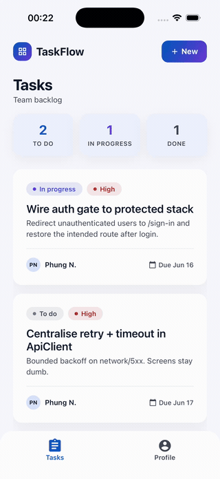
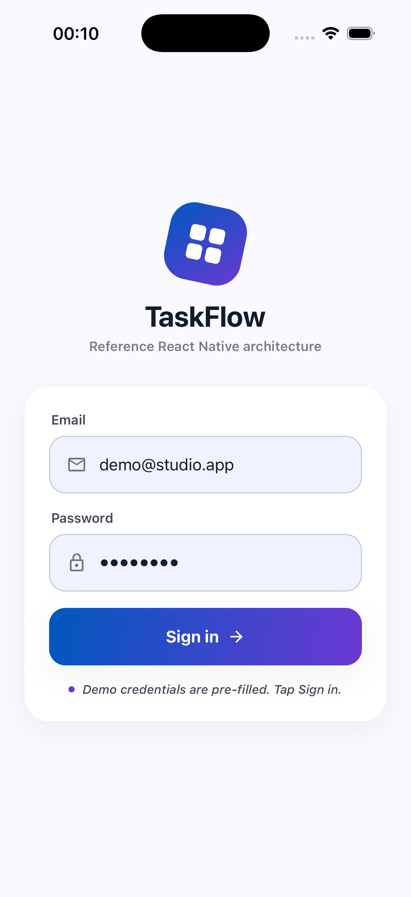
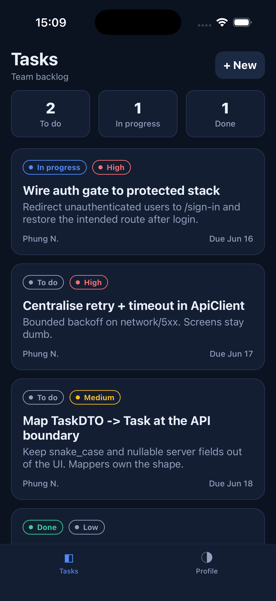
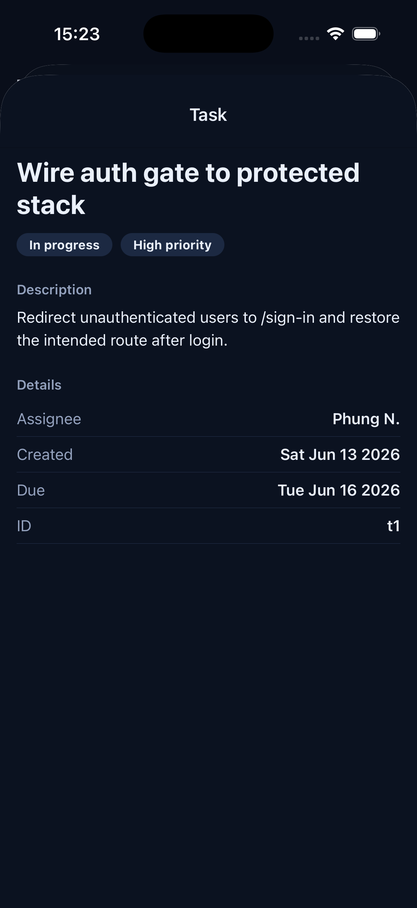
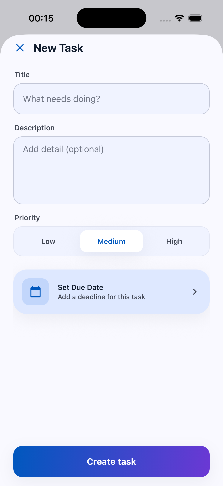
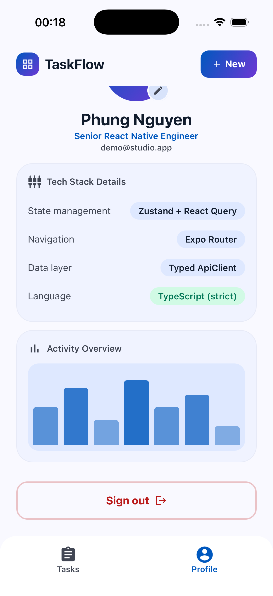
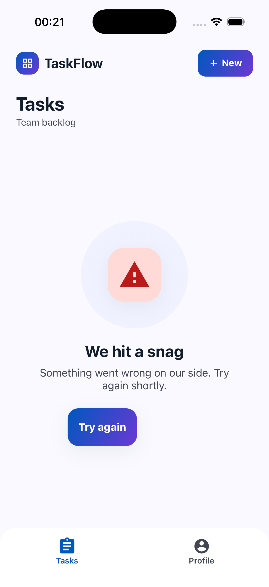
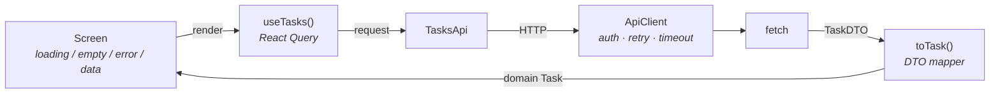
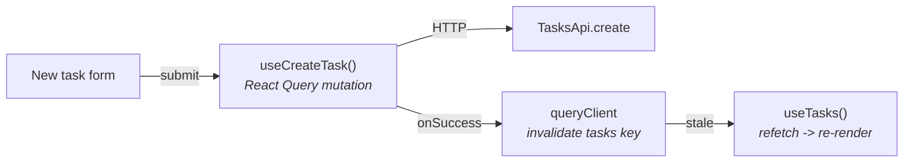

# Production Architecture (Expo / React Native)

A reference **React Native + Expo** app that demonstrates how I structure a
production-grade mobile codebase: clean layering, typed data flow, real
loading/empty/error states, an auth gate, and unit-tested business logic. The
feature itself (a small team task manager) is deliberately simple. The point is
the **architecture around it**.

> Scope: this is an architecture skeleton, not a shipped product. It shows how
> the layers fit together. Operational concerns a real release needs (error
> reporting, analytics, CI/CD, OTA updates, offline persistence, a11y pass) are
> called out under **Decisions & tradeoffs**, not implemented here.

Stack: **Expo Router** (typed file-based routes) · **TypeScript** (strict) ·
**Zustand** (client state) · **React Query** (server state) · a typed
`ApiClient` with retry/timeout/error mapping · **Jest** unit tests.

## Demo



A walkthrough of every screen - sign in, task list with summary stats, task
detail, the create-task modal, profile, and the shared error state.

## Screenshots

| Sign in | Tasks list | Task detail |
| --- | --- | --- |
|  |  |  |

| New task (modal) | Profile | Error state |
| --- | --- | --- |
|  |  |  |

Real captures from the iOS Simulator.

## What it shows

- **Feature-based structure** - each feature owns its model, API, store and
  hooks. No god `utils/` or `screens/` dumping ground.
- **Server state vs client state** - React Query owns fetched data (caching,
  refetch, invalidation); Zustand owns session/UI state. They are not mixed.
- **A typed data layer** - one `ApiClient` centralises base URL, auth header,
  timeout and bounded retry with backoff. Feature API modules map server DTOs
  into domain models, so `snake_case`/nullable wire shapes never reach the UI.
- **Errors as data** - the API layer returns a `Result<T, AppError>` instead of
  throwing across boundaries. One `AppError` shape, one place that turns an
  error into user copy.
- **Every list has three states** - loading, empty and error are rendered by a
  single shared `StateView`, driven by React Query status.
- **An auth gate in one place** - the root layout redirects based on session +
  route group. Screens never check auth themselves.
- **Design tokens** - color/spacing/radius/type live in one file, so a design
  system change from Figma is a single edit.
- **Tested business logic** - DTO mappers, sorting and the client retry policy
  are unit-tested without a UI or a network.

## Architecture

```
app/                         Expo Router routes (the UI shell)
  _layout.tsx                providers (React Query) + AUTH GATE
  index.tsx                  splash -> redirect by session
  sign-in.tsx                public route
  (tabs)/                    authenticated area
    index.tsx                tasks list (loading/empty/error/data)
    profile.tsx              user + sign out
  task/[id].tsx              typed dynamic route
  new-task.tsx               create form (modal)

src/
  lib/result.ts              Result<T> + AppError + user-facing messages
  theme/tokens.ts            design tokens (single source of truth)
  api/
    client.ts                typed HTTP client: auth, timeout, retry, mapping
    mockBackend.ts           fetch-compatible in-memory server (DTOs + latency)
    services.ts              composition root - wires everything once
  components/                Screen, Button, TextField, TaskCard, StateView
  features/
    auth/                    model · authStore (persisted) · api · hooks
    tasks/                   model + mapper · api · React Query hooks

__tests__/                   mapper + client policy unit tests
```

Data flow for one screen:



Write path - mutation, then cache invalidation drives the refetch:



Current write strategy is invalidate-on-success (server is source of truth for
ordering), not optimistic update. Optimistic writes would be a per-mutation
`onMutate`/rollback addition - intentionally left out to keep the path obvious.

### Why this stays maintainable

- A new feature is a new folder under `features/` + a route file. Nothing
  existing changes.
- Swapping the mock backend for the real API is a **small, contained change** in
  `services.ts` (drop `createMockFetch()`, point `baseUrl` at the server). No
  screen edits. A real API also brings token refresh, pagination and error
  envelopes - those land in the API layer, still not in screens.
- Cross-cutting concerns (auth header, retry, error copy) each live in exactly
  one file, so they are changed once, not hunted across screens.

These patterns are the parts that hurt at scale in real apps. The 5-screen
feature here is just enough to exercise them, not a proof of scale on its own.

## Decisions & tradeoffs

- **Zustand over Redux Toolkit** - client/session state here is small (token,
  user, UI flags). Zustand gives a persisted store with selectors and no
  boilerplate. RTK earns its weight when you need middleware, devtools-driven
  debugging or a large normalized cache - not the case at this size.
- **React Query over RTK Query** - kept the server-state library independent of
  the client-state choice. React Query's cache/invalidate/refetch model is the
  point of the read and write diagrams above; pairing it with Zustand keeps the
  two state kinds visibly separate.
- **Mock backend over MSW** - `mockBackend.ts` is `fetch`-compatible and wired
  at the composition root, so the app runs with zero setup and the swap to a
  real server is one file. MSW would be the choice once there are request
  fixtures worth sharing between the app and tests.
- **`Result<T, AppError>` over throwing** - errors cross the API boundary as
  data, so the UI handles one `AppError` shape. The unwrap-at-the-hook adapter
  keeps React Query's throw-based contract without leaking throws into screens.

### Auth token lifecycle

Token + user persist to **AsyncStorage** (`zustand/persist`), rehydrated on boot
and gated by a `hydrated` flag so the splash redirect waits for storage. The
`ApiClient` reads the token via a non-React getter, so the network layer stays
decoupled from React.

Not implemented (would be needed for production): **token stored in
`expo-secure-store`** rather than AsyncStorage, refresh-token rotation, and 401 ->
refresh -> retry in the client. The single auth-header chokepoint is where that
logic would attach.

### What's tested, what isn't

Unit-tested (Jest, no UI/network): DTO mappers, task sorting, and the client
retry/backoff policy - the pure logic most likely to regress silently. Not
covered here: component tests (React Native Testing Library) and E2E
(Maestro/Detox). The layering keeps logic testable without a UI; adding those
layers is additive, not a rewrite.

### Out of scope (intentionally)

Error reporting (Sentry), analytics, env/secret config beyond `EXPO_PUBLIC_*`,
CI/CD, EAS OTA updates, list virtualization/perf tuning, offline cache
persistence, and a full a11y pass. Each has a natural home in this structure -
left out to keep the architecture the focus.

## Run

```bash
npm install
npx expo start        # press i for iOS, a for Android
```

Demo credentials are pre-filled on the sign-in screen - tap **Sign in**. The app
runs fully on the mock backend, no server or API keys required.

```bash
npm test              # unit tests (mappers, sort, client retry)
npm run typecheck     # tsc --noEmit, strict
```
